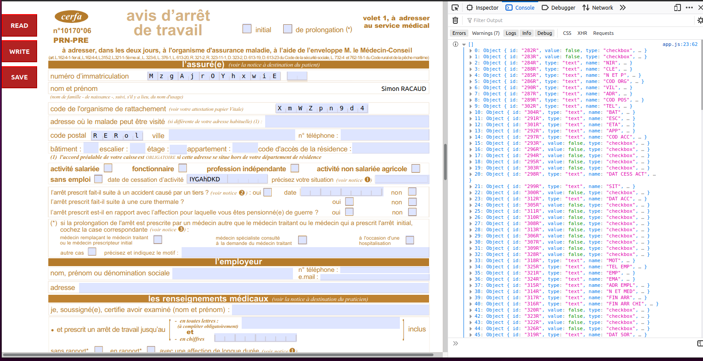

# PDF Viewer and Acroform editor

This is an example of usage of the pdf.js library.
More precisely, an usage of acroform functionality.

There is currently a big lack of documentation on the subject.

Moreover, I have written some functions to:
* Read the content of the form
* Write value in the form
* Save/download the form with the current form values

> version of pdfjs-dist : 2.6.347

# Usage

$> cd PDFJS_Viewer_Acroform

$> yarn install

$> yarn run dev

Go to : http://localhost:1234/

# Preview

